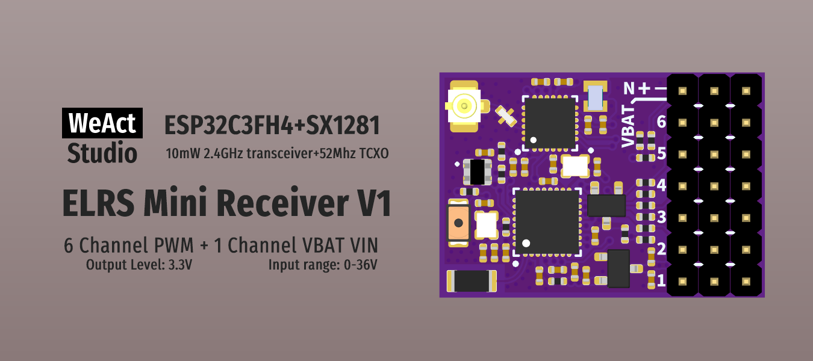

* [English version](./README.md)
# WeActStudio.ELRSMiniReceiverV1


|目录名称|内容|
| :--:|:--:|
|Doc| 数据手册|
|Hardware| 硬件开发资料|
|Firmwares|固件|

## 固件说明
* 支持接收机和发射机两种固件。  
* 接收机固件文件名：esp32c3_vx.x.x_rx_firmware_0x0000.bin  
* 发射机固件文件名：esp32c3_vx.x.x_tx_firmware_0x0000.bin  
### 接收机固件
* LED状态说明 https://www.expresslrs.org/quick-start/led-status/  
  |LED 指示|状态|
  | :--:|:--:|
  |彩虹渐变效果|启动中|
  |绿色心跳|Web更新模式已启用|
  |橙色慢速闪烁500ms开/关|等待发射机连接|
  |红色闪烁100ms开/关|无线电芯片未检测到|
  |橙色双闪然后暂停|绑定模式已启用|
  |橙色三重闪烁然后暂停|已连接发射机但模型匹配配置不匹配|
  |实心单颜色|已连接发射机，颜色表示数据包速率|
  |无灯|关闭或在Bootloader模式下|
* 按钮说明
  |按钮|说明|
  | :--:|:--:|
  |长按|进入绑定模式 -> Web Server模式 -> 重启|
  |长按后上电|进入烧录模式|
* 进入绑定模式  
方法1. 长按按钮，等待LED变为橙色双闪然后暂停状态。  
方法2. 反复上电3次，等待LED变为橙色双闪然后暂停状态。  

### 发射机固件
> CRSF UART 波特率自适应，支持400000, 115200, 5250000, 3750000, 1870000, 921600, 2250000。  
* LED状态说明 https://www.expresslrs.org/quick-start/led-status/  
  |LED 指示|状态|
  | :--:|:--:|
  |蓝色心跳|蓝牙摇杆已启用|
  |实心单颜色|已连接接收机，颜色表示数据包速率|
  |渐变单颜色|未连接接收机，颜色表示数据包速率|
  |每秒橙色闪烁一次|未连接手柄|
  |红色闪烁100ms on/off|无线电芯片未检测到|
  |彩虹渐变效果|启动中|
  |绿色心跳|Web更新模式已启用|


## 管脚说明
* 接收机管脚：
  ```
  {
    "radio_busy": 3,
    "radio_dio1": 1,
    "radio_miso": 5,
    "radio_mosi": 4,
    "radio_nss": 7,
    "radio_sck": 6,
    "radio_dcdc": true,
    "power_min": 0,
    "power_high": 0,
    "power_max": 0,
    "power_default": 0,
    "power_control": 0,
    "power_values": [13],
    "power_lna_gain": 0,
    "pwm_outputs": [2,10,18,19,20,21],
    "button": 9,
    "led_rgb": 8,
    "led_rgb_isgrb": true,
    "vbat": 0,
    "vbat_offset": 12,
    "vbat_scale": 1180
  }
  ```
* 发射机管脚：
  ```
  {
    "radio_busy": 3,
    "radio_dio1": 1,
    "radio_miso": 5,
    "radio_mosi": 4,
    "radio_nss": 7,
    "radio_sck": 6,
    "radio_dcdc": true,
    "power_min": 0,
    "power_high": 0,
    "power_max": 0,
    "power_default": 0,
    "power_control": 0,
    "power_values": [13],
    "power_lna_gain": 0,
    "serial_rx": 20,
    "serial_tx": 21,
    "button": 9,
    "led_rgb": 8,
    "led_rgb_isgrb": true
  }
  ```
## VIN VBT电路说明
> 输入电压：0-36V  


```
/*---------------------------------------
- WeAct Studio Official Link
- taobao: weactstudio.taobao.com
- aliexpress: weactstudio.aliexpress.com
- github: github.com/WeActStudio
- gitee: gitee.com/WeAct-TC
- blog: www.weact-tc.cn
---------------------------------------*/
```